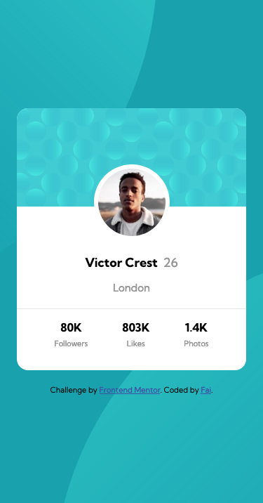

# Frontend Mentor - Profile card component solution

This is a solution to the [Profile card component challenge on Frontend Mentor](https://www.frontendmentor.io/challenges/profile-card-component-cfArpWshJ). Frontend Mentor challenges help you improve your coding skills by building realistic projects. 

## Table of contents

  - [The challenge](#the-challenge)
  - [Screenshot](#screenshot)
  - [Links](#links)
  - [Built with](#built-with)
- [Author](#author)

### The challenge

- Build out the project to the designs provided

### Screenshot

### Links

- Solution URL: [https://github.com/Fsanea/profile-card-component-main](https://github.com/Fsanea/profile-card-component-main)
- Live Site URL: [https://fsanea.github.io/profile-card-component-main/](https://fsanea.github.io/profile-card-component-main/)

## My process

### Built with

- Semantic HTML5 markup
- CSS custom properties
- Flexbox

## Author

- Frontend Mentor - [@fsanea](https://www.frontendmentor.io/profile/fsanea)
- Twitter - [@fsanea](https://www.twitter.com/fsanea)

